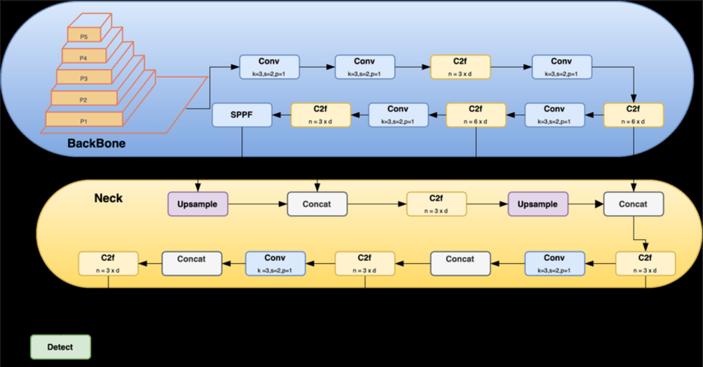
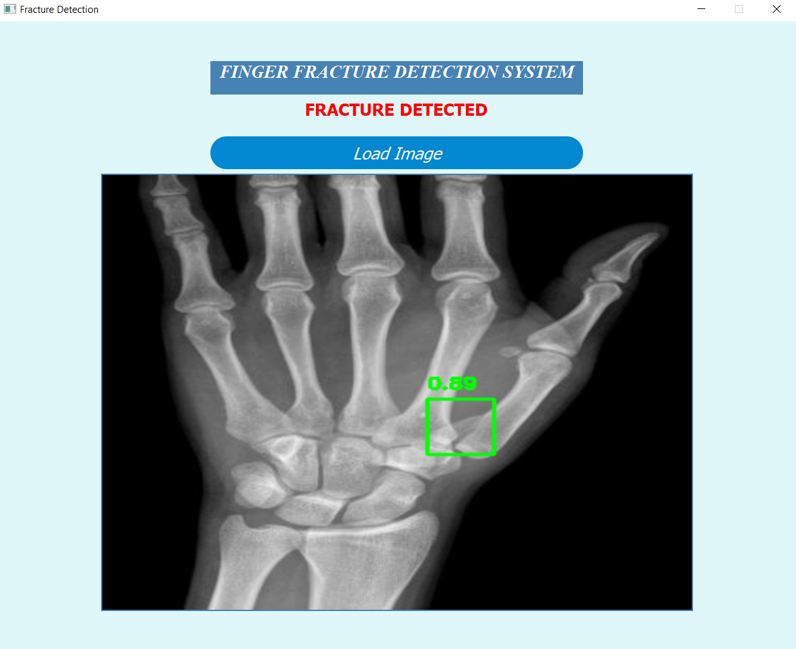

# Finger Fracture Detection System

## Overview
The Finger Fracture Detection System is a specialized tool designed to detect fractures in X-ray images of fingers. The project utilizes a fine-tuned YOLOv8 model, a state-of-the-art object detection model, to identify fractures and place bounding boxes around them. The user interface is built using PyQt5, making the application user-friendly and interactive. OpenCV is used for reading and displaying images within the application.

## Features
- **Fracture Detection:** The model accurately detects fractures in finger X-ray images and draws bounding boxes around the detected areas.
- **User Interface:** A simple and intuitive UI created with PyQt5 allows users to easily interact with the system.
- **Image Handling:** OpenCV is utilized for image reading and displaying results within the application.

## Model
- **Architecture:** The model is based on the YOLOv8 architecture, which has been fine-tuned using a pretrained model. 
- **Performance:** The model has achieved the following results on the test dataset:
  - Precision: **99.24%**
  - Recall: **87.50%**
  - mAP50: **89.31%**
  - mAP50-95: **72.92%**

## Screenshots
- **Architecture:** The architecture of YOLOv8 is detailed in the image below.
  
- **Demo:** The following image demonstrates the system's performance on a test dataset.
  
